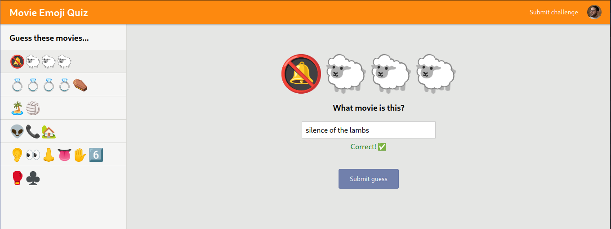

# Emoji quiz app

> A simple quiz app to get a movie's name using emojis.

- [Remix Docs](https://remix.run/docs)
- Original App [from](https://clerk.dev/tutorials/build-movie-emoji-quiz-with-remix-fauna-and-clerk)

## Requirements

This app uses [Clerk](https://dashboard.clerk.dev/sign-up) for authentication and [FaunaDB](https://docs.fauna.com/fauna/current/) as the DB.

## Final result



## Development

From your terminal:

```sh
npm run dev
```

This starts your app in development mode, rebuilding assets on file changes.
